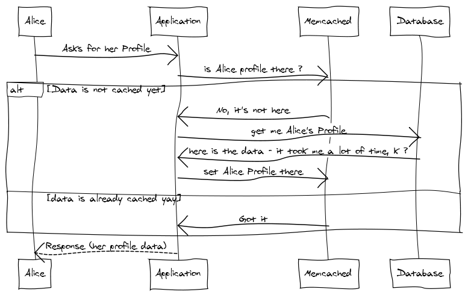

### Estruturas de dados probabilisticas (Sketch Data Structures) e Go

#####     Introdução
Este ebook é um trabalho em progresso constante. Eu vou adicionando e modificando de acordo com meu aprendizado e também com novidades que encontro. A minha intenção é ter um guia rápido em português que possa ajudar a resolver problemas de engenharia de dados com Go.

As anotações começaram como meu diário de uso de Go para serviços de uso bem especifico: contar, acumular e registrar grandes volumes de dados em alta velocidade. Estes problemas são descrito há muito tempo e aparece de várias formas: brokers de mensagens, servidores de coleta de dados, pixel de tracking para trafego web, coleta de metricas em dispositivos móveis e monitoração de serviços.

Meu primeiro contato com Go foi em um curso em 2011 na OSCON, uma conferencia da OReilly. Eu havia lido sobre a linguagem e fiquei interessado na simplicidade. Nesta época, eu programava em Python usando o framework Twisted para fazer meus servidores. "Programava" é um eufemismo para o pouco que conseguia fazer entre outras atribuições. Após este curso eu tentei portar alguns projetos para Go sem muito compromisso. 

Meu jeito de aprender uma linguagem ou framework é fazer uma versão simples do projeto [Memcached](https://github.com/gleicon/beano) e do meu projeto [RESTMQ](https://github.com/gleicon/restmq), para entender como fazer um servidor, como atender requisições, como guardar dados e serialização. Eles foram bem mas continuei sem compromisso até que o meu time resolveu um problema de roteamento de email em larga escala e volume em Go. Este projeto me chamou a atenção pela simplicidade e escalabilidade. Na época usando maquinas fisicas a redução de uso de recursos foi impressionante.

Assim comecei a investir mais tempo ajudando em alguns projetos opensource para pegar o jeito da linguagem e tenho feito isso desde então. 

O mesmo aconteceu com estruturas de dados probabilisticas. Eu vou contar como tive contato com elas, minha motivação e explica-las de uma forma simples com referências para quem se interessar em profundidade, para manter este livro breve.

Nesta jornada eu tive vários momentos que só posso descrever como "solução a procura de um problema": as vezes lia um artigo ou via um exemplo de código e revisava meus projetos e o trabalho a procura de uma oportunidade de usar a idéia.

##### Cache

Meu primeiro contato com estrutura de dados probabilisticas foi provavelmente como o da maioria das pessoas em 2011, um post descrevendo como o Google Chrome usava Bloom Filters para seu recurso de "Safe Browsing". Hoje em dia o Chrome utiliza outra técnica que envolve uma estrutura chamada Prefix Set e você pode ler a transição [aqui](https://bugs.chromium.org/p/chromium/issues/detail?id=71832).

 A idéia de ter um "cache" (estrutura que armazena valores pré calculados em memória ou disco local) não é nova, frameworks e aplicações fazem isso há algum tempo. O projeto SQLLite é usado pelo Chrome desta maneira e para a maioria das aplicações móveis. 
 
 Existem servidores como Memcached e Redis que provêm o serviço de guardar esta estrutura de forma acessivel para mais de uma instancia da mesma aplicação, que é essencialmente um servidor com um "Map" (dicionario) que disponibiliza suas funções de Get e Set pela rede usando um protocolo de comunicação definido.
 
 Para ilustrar este fluxo vou usar a figura abaixo:

Este fluxo é simples: Se imaginarmos um sistema em que uma usuária precisa acessar seu "Profile" guardado em um banco de dados para mostrar seus dados você pode acessar diretamente o banco em todas as requisições gerando I/O e uso de CPU concorrente com outras requisições a este banco. 

Se analisarmos o padrão das solicitações a este banco, vai notar que o dado nele não muda a todo o instante. Com uma modificação no fluxo de acesso você pode guardar a solicitação a uma requisição em um sistema de cache e da proxima vez servi-lo da memória. Isso exige que os dados "expirem" ou se invalidem automaticamente para garantir que modificações vao ser vistas (troca de sobrenome ou endereço por exemplo).

Esta modificação é apenas verificar se a resposta a uma requisição existe no cache. Isso geralmente é feito usando o modelo "K/V - Key Value" (Chave/Valor). É a assinatura de uma estrutura de dados do tipo Hash ou Dicionário. Você pode usar a query inteira como Chave, e receber seu resultado como Valor.

Esta explicação é importante para voltarmos ao Bloom Filter. No Chrome existem vários caches mas um deles pode crescer rápido: o do Safe Browsing. Safe Browsing é uma lista que o Google mantém baseado em duas pesquisas e reclamações recebidas sobre sites inseguros. Para que o browser não tivesse que consultar um serviço web a todo momento, com implicações de performance e segurança, foi decidido que esta lista poderia ser atualizada por download de tempos em tempos.

A lista poderia - e ficou - maior que o que a memória de uma maquina poderia guardar, então guarda-la em um arquivo para consulta rápida foi considerado. Mas guardar as URLs inteiras seria um problema pelo tamanho que elas podem ter. Foi decidido guardar um Hash de cada URL, ou seja aplicada uma função em cada URL que mapearia um texto a um valor de tamanho fixo. Se usarmos os dados do [HTTP Archive](https://httparchive.org/reports/state-of-the-web) e colocassemos 25% das URLs existentes nesta lista, ficaria complexo conferir a cada request se uma URL esta na lista de URLs do safe browsing.

Á epoca foi decidido colocar esta lista em uma estrutura chamada Bloom Filter que depois mudaria para outra estrutura por conta do tamanho em disco e outras limitações descritas no link acima. Mas vamos focar no Bloom Filter.

##### Bloom Filter

Bloom filter é uma estrutura de dado probabilistica que diz a probabilidade de um membro pertencer a um conjunto. Para entender o bloom filter precisamos entender seus componentes:

###### O que é um conjunto (Set)

Um conjunto é uma estrutura de dados que de forma simplificada guarda um item único por posição. Conjuntos podem ser combinados, comparados e subtraidos (Union, Compare, Difference). No Bloom filter a estrutura usada é um BitSet, Conjunto de bits. Esta estrutura também é chamada de Bit Array e é uma lista grande em que cada posição representa um bit. 

###### Funções de Hash

Dado um item a ser inserido, deve ser calculado seu Hash usando funções que vão mapear o item a varias posições do BitSet mencionado anteriormente

 Fica mais facil visualizar com um diagrama (fonte: [wikipedia](https://commons.wikimedia.org/wiki/File:Bloom_filter.svg))
 
 
 
 Os elementos {x,y,z} estão presentes no filtro. As setas coloridas sao as funções de hash utilizadas para modificar os bits no BitSet (a lista de 0 e 1). O elemento {w} não está no BitSet.
 
 Com isso podemos afirmar que o Bloom Filter tem quase certeza de que os elementos {x,y,z} estão lá. Mas tem certeza absoluta de que {w} não está representado.
 
 Está é uma característica do Bloom Filter. Ele pode dar falsos positivos (afirmar que um item existe mas ele não ter sido inserido) mas nunca dá falsos negativos. Esta caracteristica se junta a velocidade e economia de espaço como pontos de escolha do algoritmo.
 
|              | Velocidade                                  | Espaço                               | Falso-Positivo | Falso negativo |
|--------------|---------------------------------------------|--------------------------------------|----------------|----------------|
| Hash         | Pior caso tem que percorrer todas as chaves | Guarda todos os valores              | nunca          | nunca          |
| Bloom Filter | Pior caso é o tamanho do bitset             | Guarda uma representação dos valores | sim            | nunca          |

 

#####     Servers em Go
#####     Databases locais
#####     Bloom Filter
#####     Cuckoo Filter
#####     HyperLogLog
#####     Bonus: DDK

