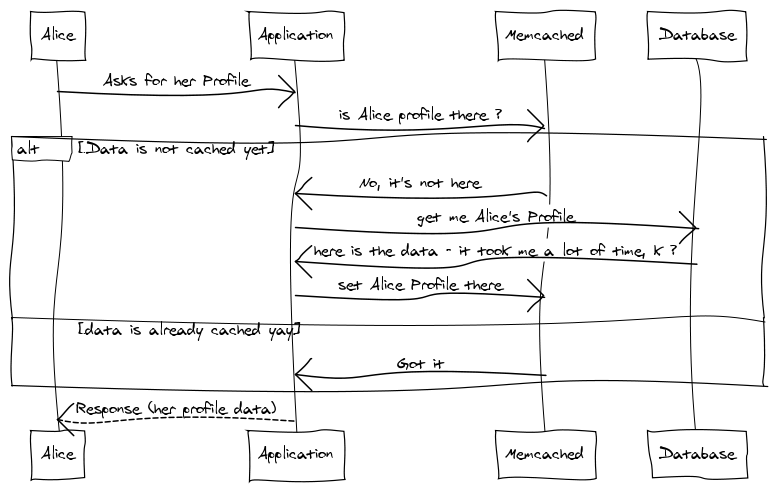
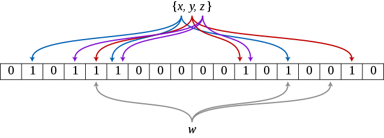
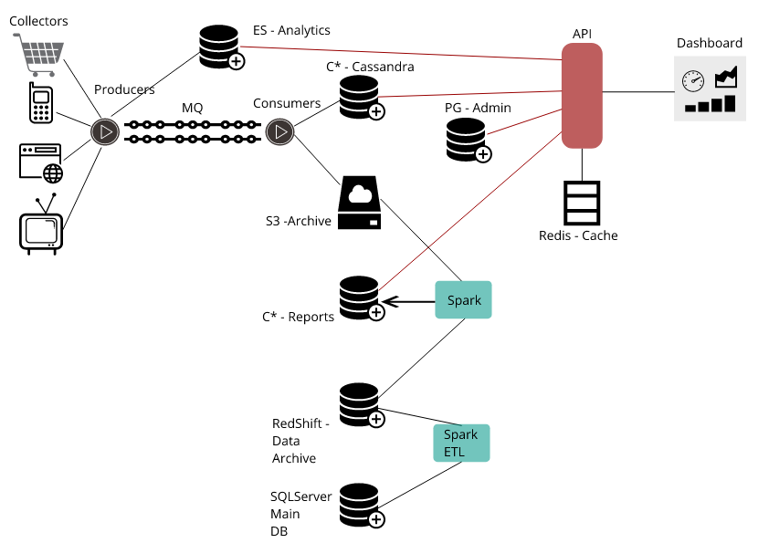
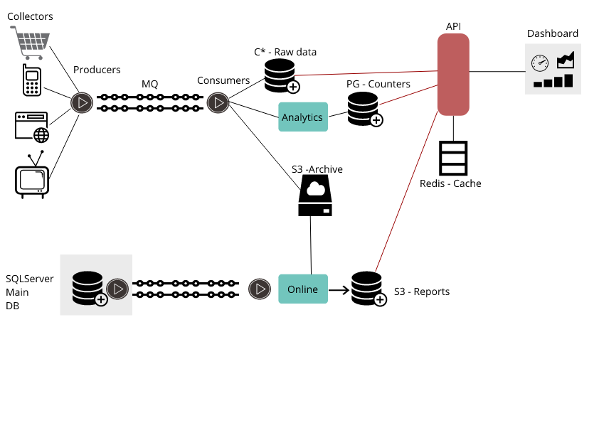
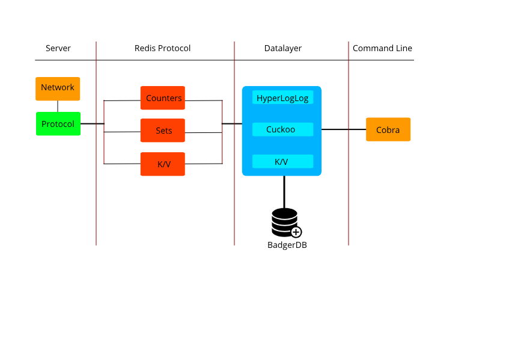

### Estruturas de dados probabilísticas (Sketch Data Structures) e Go

#### Introdução
Este ebook é um trabalho em progresso constante. Eu vou adicionando e modificando de acordo com meu aprendizado e também com novidades que encontro. A minha intenção é ter um guia rápido em português que possa ajudar a resolver problemas de engenharia de dados com Go.

As anotações começaram como meu diário de uso de Go para serviços de uso bem especifico: contar, acumular e registrar grandes volumes de dados em alta velocidade. Estes problemas são descritos há muito tempo e aparecem de várias formas: brokers de mensagens, servidores de coleta de dados, pixel de tracking para trafego web, coleta de metricas em dispositivos móveis, monitoração de serviços, entre outros.

Meu primeiro contato com Go foi em um curso em 2011 na OSCON, uma conferencia da O'Reilly. Eu havia lido sobre a linguagem e fiquei interessado na simplicidade. Nesta época, eu programava em Python usando o framework Twisted para fazer meus servidores. "Programava" é um eufemismo para o pouco que conseguia fazer entre outras atribuições. Após este curso eu tentei portar alguns projetos para Go sem muito compromisso.

Meu jeito de aprender uma linguagem ou framework é fazer uma versão simples do projeto [Memcached](https://github.com/gleicon/beano) e do meu projeto [RESTMQ](https://github.com/gleicon/restmq), para entender como fazer um servidor, como atender requisições, como guardar dados e serialização. Eles foram bem mas continuei sem compromisso até que o meu time resolveu um problema de roteamento de email em larga escala e volume em Go. Este projeto me chamou a atenção pela simplicidade e escalabilidade. Na época usando maquinas fisicas a redução de uso de recursos foi impressionante.

Comecei a investir mais tempo ajudando em alguns projetos opensource para pegar o jeito da linguagem, comecei a portar ou criar pequenos projetos e tenho usado Go desde então.

O mesmo aconteceu com estruturas de dados probabilísticas. Eu vou contar como tive contato com elas, minha motivação e explica-las de uma forma simples com referências para quem se interessar em profundidade, para manter este livro breve.

Nesta jornada eu tive vários momentos que só posso descrever como "_solução a procura de um problema_": as vezes lia um artigo ou via um exemplo de código e revisava meus projetos e o trabalho a procura de uma oportunidade de usar a idéia.


#### Cache


Meu primeiro contato com estrutura de dados probabilisticas foi provavelmente como o da maioria das pessoas em 2011, um post descrevendo como o Google Chrome usava Bloom Filters para seu recurso de "Safe Browsing". Hoje em dia o Chrome utiliza outra técnica que envolve uma estrutura chamada Prefix Set e você pode ler a transição [aqui](https://bugs.chromium.org/p/chromium/issues/detail?id=71832).

 A idéia de ter um "cache" (estrutura que armazena valores pré calculados em memória ou disco local) não é nova, frameworks e aplicações fazem isso há algum tempo. O projeto SQLLite é usado pelo Chrome desta maneira e para a maioria das aplicações móveis. 
 
 Existem servidores como Memcached e Redis que provêm o serviço de guardar esta estrutura de forma acessivel para mais de uma instância da mesma aplicação, que é essencialmente um servidor com um "Map" (dicionario) que disponibiliza suas funções de Get e Set pela rede usando um protocolo de comunicação definido.
 
 Para ilustrar este fluxo vou usar a figura abaixo:



Este fluxo é simples: Se imaginarmos um sistema em que uma usuária precisa acessar seu "Profile" guardado em um banco de dados para mostrar seus dados você pode acessar diretamente o banco em todas as requisições gerando I/O e uso de CPU concorrente com outras requisições a este banco.

Se analisarmos o padrão das solicitações a este banco de dados e como suas informações são atualizadas, veremos que nem todas as tabelas mudam em conjunto. Se modificarmos o fluxo de acesso podemos guardar a resposta a uma requisição em um sistema de cache e da proxima vez servi-lo da memória. Isso exige que os dados "expirem" ou se invalidem automaticamente para garantir que modificações vejam vistas (troca de sobrenome ou endereço por exemplo).

Esta modificação adiciona um componente novo ao sistema e intercepta as requisições para verificar se a resposta a uma requisição já existe no cache. Isso é feito usando o modelo "K/V - Key Value" (Chave/Valor). Esta é a assinatura de uma estrutura de dados do tipo Hash ou Dicionário. Você pode usar a query como Chave, e receber seu resultado como Valor.

Esta explicação é importante para voltarmos ao Bloom Filter e ao exemplo do SafeBrowsing. O Chrome tem vários caches que crescem em "velocidades" distintas. Safe Browsing é uma lista que o Google mantém baseado em duas pesquisas e reclamações recebidas sobre sites inseguros. Para que o browser não tivesse que consultar um serviço web a todo momento, com implicações de performance e segurança, foi decidido que esta lista poderia ser atualizada por download de tempos em tempos.

A lista poderia ficar - e ficou - maior que o que a memória de um processo poderia guardar, então guarda-la em um arquivo para consulta rápida foi considerado. Mas guardar as URLs inteiras seria um problema pelo tamanho que elas podem ter. Foi decidido guardar um Hash de cada URL, ou seja aplicada uma função em cada URL que mapearia um texto a um valor de tamanho fixo. Se usarmos os dados do [HTTP Archive](https://httparchive.org/reports/state-of-the-web) e colocassemos 25% das URLs existentes nesta lista, ficaria complexo conferir a cada request se uma URL esta na lista de URLs do safe browsing.

Á epoca foi decidido colocar esta lista em uma estrutura chamada Bloom Filter que depois mudou para outra estrutura por conta do tamanho em disco e outras limitações descritas no link acima. Mas vamos focar no Bloom Filter.

#### Bloom Filter

Bloom filter é uma estrutura de dado probabilística de baixo consumo de espaço e alta velocidade, que deixa testar a probabilidade de um membro pertencer a um conjunto. Para entender o bloom filter precisamos entender seus componentes:

###### O que é um conjunto (Set)?

Um conjunto é uma estrutura de dados que de forma simplificada guarda um item único por posição. Conjuntos podem ser combinados, comparados e subtraidos (Union, Compare, Difference). No Bloom filter a estrutura usada é um BitSet, Conjunto de bits. Esta estrutura também é chamada de Bit Array e é uma lista grande em que cada posição representa um bit.

###### Funções de Hash

Dado um item a ser inserido, deve ser calculado seu Hash usando funções que vão mapear o item a varias posições do BitSet mencionado anteriormente.


 Fica mais facil visualizar com um diagrama (fonte: [wikipedia](https://commons.wikimedia.org/wiki/File:Bloom_filter.svg))
 
 
 
 Os elementos **{x,y,z}** foram adicionados no BitSet. As setas coloridas sao as funções de hash utilizadas para modificar os bits no BitSet (a lista de 0 e 1). O elemento **{w}** não está no BitSet.
 
 O BitSet resultante das adições cria uma situação interessante. O Bloom Filter tem _quase certeza_ de que os elementos **{x,y,z}** estão lá. Mas tem certeza absoluta de que  **{w}** não está representado. Porque quase certeza ? Existe a chance de que se procurarmos um elemento não existente no BitSet, uma de suas funções Hash indique um bit que esta em `1`.
 
 Esta é uma característica do Bloom Filter. Ele pode dar falsos positivos (afirmar que um item existe mas ele não ter sido inserido) mas nunca dá falsos negativos. A chance de falso positivos aumenta conforme aumenta o número de elementos adicionados ao Bloom Filter.
 
 Esta caracteristica se junta à velocidade e economia de espaço como pontos de escolha do algoritmo. O Bloom Filter não permite que um elemento seja "Deletado".

A tabela abaixo compara Bloom Filter com um Hash/Dictionary/Map nestas caracteristicas:
 
| Tipo         | Velocidade                                   | Guarda todos os valores (uso de espaço)                  | Falso Positivos | Falso Negativos | Deleta Itens ? |
|--------------|----------------------------------------------|----------------------------------------------------------|-----------------|-----------------|----------------|
| Hash         | Pior caso tem que percorrer todas as chaves  | sim                                                      | não             | não             | sim            |
| Bloom Filter | Pior caso é relacionado ao tamanho do BitSet | Usa a representação menor dos valores com hash functions | sim             | não             | não            |
|              |                                              |                                                          |                 |                 |                |

Vamos usar uma biblioteca para testar o Bloom Filter. Escolhi a biblioteca do site YourBasic pois é simples de usar e visualizar a implementação. O código fonte da biblioteca está em https://github.com/yourbasic/bloom. O playground para este codigo fica em https://play.golang.org/p/tDnQrVV3xBS.

 ```
package main

import (
	"fmt"

	"github.com/yourbasic/bloom"
)

var safeBrowsingList *bloom.Filter

func testAndReport(url string) {
	if safeBrowsingList.Test(url) {
		fmt.Println(url, "is not safe")
	} else {
		fmt.Println(url, "seems safe")
	}
}

func main() {
	// 1000 elementos, erro de 1/20 (0.5%)
	safeBrowsingList = bloom.New(1000, 20)

	safeBrowsingList.Add("https://badsite.com")
	safeBrowsingList.Add("https://anotherbadsite.com")

	fmt.Printf("Sites: %d\n", safeBrowsingList.Count())

	testAndReport("https://lerolero.com")
	testAndReport("https://badsite.com")
}

 ```

O código acima cria um Bloom Filter com 1000 posições e uma taxa de falsos positivos estimada de 1 em 20. Este número é utilizado para calcular quantos _lookups_(passadas ou buscas) serão feitas no bitset ao adicionar ou testar um item. É importante pois junto com as funções de Hash e o tamanho do BitSet ajuda a controlar a taxa de falso positivos.

Esta biblioteca não implementa uma forma fácil de serialização de dados. Serializar dados é um modo de transformar uma estrutura de dados em um formato que pode ser guardado em um arquivo ou memória e recuperado posteriormente. Isso nos ajudaria a criar um Bloom Filter em um lugar e replica-lo para outro, como o Chrome fazia.

Uma aplicação interessante de Bloom Filters é em banco de dados. O Cassandra utiliza Bloom Filters no caminho de leitura, pois consolida dados em disco com memória. Para evitar acesso ao disco e um full scan (procurar um dado em todas as tabelas em disco) foi implementado um Bloom Filter para criar uma barreira de acesso [https://cassandra.apache.org/doc/latest/operating/bloom_filters.html](https://cassandra.apache.org/doc/latest/operating/bloom_filters.html).

O LevelDB do Google, um banco de dados local chave/valor também utiliza Bloom Filters para mapear os blocos em disco em uma estrutura que chega a reduzir em 100 vezes a necessidade de I/O [https://github.com/google/leveldb/blob/master/doc/index.md](https://github.com/google/leveldb/blob/master/doc/index.md).

Se você se interessar por mais detalhes sobre Bloom Filters, a página da Wikipédia  [https://en.wikipedia.org/wiki/Bloom_filter](https://en.wikipedia.org/wiki/Bloom_filter) tem um conteúdo interessante, que explica o artigo original e detalha suas configurações.


#### Cuckoo Filter

O Cuckoo Filter vive na mesma categoria que o Bloom Filter, é uma implementação das mesmas idéias mas que permite a remoção de um elemento e implementa pequenas mudanças que ajudam a diminuir os falsos positivos. Existem implementações de Bloom Filter que permitem remover itens também com uma troca de eficiencia ou espaço ocupado.

O Bloom Filter é mais eficiente em espaço e busca para largos volumes de dados mas as aplicações são semelhantes, você poderia trocar um pelo outro. A vantagem é a remoção de elementos e a melhora dos falsos positivos, que aumentam no Bloom Filter conforme mais dados são armazenados.

Este artigo https://www.cs.cmu.edu/~dga/papers/cuckoo-conext2014.pdf explica como o Cuckoo Filter implementa suas funções de hash e correção de erros. Como no exemplo anterior vou usar uma biblioteca [https://github.com/seiflotfy/cuckoofilter](https://github.com/seiflotfy/cuckoofilter). Você pode rodar o exemplo em https://play.golang.org/p/zVIbXlbgSMl.

```
package main

import (
	"fmt"

	cuckoo "github.com/seiflotfy/cuckoofilter"
)

var safeBrowsingList *cuckoo.Filter

func testAndReport(url string) {
	uu := []byte(url)
	if safeBrowsingList.Lookup(uu) {
		fmt.Println(url, "is not safe")
	} else {
		fmt.Println(url, "seems safe")
	}
}

func main() {
	safeBrowsingList = cuckoo.NewFilter(1000)
	safeBrowsingList.InsertUnique([]byte("https://badsite.com"))
	safeBrowsingList.InsertUnique([]byte("https://anotherbadsite.com"))

	testAndReport("https://badsite.com")
	testAndReport("https://anotherbadsite.com")
	testAndReport("https://lerolero.com")

	count := safeBrowsingList.Count()
	fmt.Printf("Items: %d\n", count)

	// Delete a string (and it a miss)
	safeBrowsingList.Delete([]byte("hello"))

	count = safeBrowsingList.Count()
	fmt.Printf("Items: %d\n", count)

	// Delete a string (a hit)
	safeBrowsingList.Delete([]byte("https://badsite.com"))

	count = safeBrowsingList.Count()
	fmt.Printf("Items: %d\n", count)

	safeBrowsingList.Reset() // reset

	count = safeBrowsingList.Count()
	fmt.Printf("Items: %d\n", count)
}

```

O código é parecido com o que usei para mostrar o Bloom Filter, com a contagem de elementos no Cuckoo Filter entre as operações e também com a operação de DELETE de um item. Esta biblioteca fornece funções de serialização/deserialização também. O código é bem interessante de ler.

Posso alterar meu código para guardar o filtro e carregar depois com as funções **Encode** e **Decode** https://play.golang.org/p/urTVjJX6xHP.

```
package main

import (
	"fmt"

	cuckoo "github.com/seiflotfy/cuckoofilter"
)

var safeBrowsingList *cuckoo.Filter

func testAndReport(filter *cuckoo.Filter, url string) {
	uu := []byte(url)
	if filter.Lookup(uu) {
		fmt.Println(url, "is not safe")
	} else {
		fmt.Println(url, "seems safe")
	}
}

func main() {
	safeBrowsingList = cuckoo.NewFilter(1000)
	safeBrowsingList.InsertUnique([]byte("https://badsite.com"))
	safeBrowsingList.InsertUnique([]byte("https://anotherbadsite.com"))

	testAndReport(safeBrowsingList, "https://badsite.com")
	testAndReport(safeBrowsingList, "https://anotherbadsite.com")
	testAndReport(safeBrowsingList, "https://lerolero.com")

	count := safeBrowsingList.Count()
	fmt.Printf("Items: %d\n", count)

	// Delete a string (and it a miss)
	safeBrowsingList.Delete([]byte("hello"))

	count = safeBrowsingList.Count()
	fmt.Printf("Items: %d\n", count)

	fmt.Println("Encoding")

	serFilter := safeBrowsingList.Encode()

	fmt.Printf("Serialized: % x\n", serFilter)

	BackupsafeBrowsingList, _ := cuckoo.Decode(serFilter)

	count = BackupsafeBrowsingList.Count()
	fmt.Printf("Items: %d\n", count)

	testAndReport(BackupsafeBrowsingList, "https://badsite.com")
	testAndReport(BackupsafeBrowsingList, "https://anotherbadsite.com")
	testAndReport(BackupsafeBrowsingList, "https://lerolero.com")
}

```

Eu não gravei o filter em um arquivo, mas poderia ter feito com poucas modificações. Na parte final do programa acima usei a função Decode() do tipo _cuckoo.Filter_ para gerar um "dump" que pode ser reconstruido. Em Go poderiamos usar um protocolo de serialização como Gob ou binary diretamente também, implementando as funções no tipo.

Minha intenção foi comparar os usos e demonstrar como a remoção de um elemento deste filter funciona. Na saida do programa você pode ver o tamanho da estrutura de dados, sabendo que mesmo que adicionasse mais sites, este tamanho não mudaria.


#### HyperLogLog

Existe um problema em ciência da computação chamado _count-distinct_- ou estimativa de cardinalidade que procura soluções para encontrar o número de elementos distintos (únicos) em um stream (sequência) de dados que pode conter elementos repetidos. Um pouco a frente vou falar de um problema que tivemos para contar um grande volume de clicks, ou visitas de dispositivos, mantendo contadores totais e de visitas únicas entre mais de 40 trilhões de documentos.

Este problema tem aplicações bem interessantes em IoT, monitoração, data science e analytics e com o crescente volume de dados é um grupo de algoritmos interessante de estudar para entender o impacto de performance e precisão das soluções existentes.

Produtos como Elasticsearch e InfluxDB utilizam o algoritmo HyperLogLog++ para estimar a cardinalidade de agregações e conjuntos de dados acima de um certo número.

Em [https://www.elastic.co/guide/en/elasticsearch/reference/current/search-aggregations-metrics-cardinality-aggregation.html](https://www.elastic.co/guide/en/elasticsearch/reference/current/search-aggregations-metrics-cardinality-aggregation.html) podemos ver que agregações são guardadas em uma estrutura chamada HyperLogLog++. A documentação fala sobre cardinalidade, o tamanho do conjunto de documentos e também sobre a precisão.

No InfluxDB as metricas internas também usam HyperLogLog para prover contadores de monitoração [https://docs.influxdata.com/platform/monitoring/influxdata-platform/tools/measurements-internal/](https://docs.influxdata.com/platform/monitoring/influxdata-platform/tools/measurements-internal/). O Redis provê um tipo baseado em HLL(abreviação para HyperLogLog) nos comandos iniciados com PF*.

O Google publicou um artigo sobre este algoritmo com melhorias para seus casos e comparação com o algoritmo original [https://research.google/pubs/pub40671/](https://research.google/pubs/pub40671/). Pesquisadores continuam implementando mudanças para casos especificos como este conjunto de modificações descritas nestes slides [https://csqjxiao.github.io/PersonalPage/csqjxiao_files/papers/INFOCOM17-slides.pdf](https://csqjxiao.github.io/PersonalPage/csqjxiao_files/papers/INFOCOM17-slides.pdf).

A biblioteca que vou usar é baseada neste ultimo trabalho \, [https://github.com/axiomhq/hyperloglog](https://github.com/axiomhq/hyperloglog) e provê uma implementação interessante de HLL, com serialização e otimização da função de hash com redução do espaço utilizado.

Você pode rodar o exemplo abaixo no play: https://play.golang.org/p/S5cHfBGLpcF.

```
package main

import (
	"fmt"
	"strconv"

	"github.com/axiomhq/hyperloglog"
)

func estimateError(got, exp uint64) float64 {
	var delta uint64
	if got > exp {
		delta = got - exp
	} else {
		delta = exp - got
	}
	return float64(delta) / float64(exp)
}

func main() {
	axiom := hyperloglog.New16()

	step := 10
	unique := map[string]bool{}

	for i := 1; len(unique) < 10000000; i++ {
		str := "stream-" + strconv.Itoa(i)
		axiom.Insert([]byte(str))
		unique[str] = true

		if len(unique)%step == 0 || len(unique) == 10000000 {
			step *= 5
			exact := uint64(len(unique))
			res := axiom.Estimate()
			ratio := 100 * estimateError(res, exact)
			fmt.Printf("Exact count %d \nHLL count %d (%.4f%% off)\n\n", exact, res, ratio)
		}
	}

	data2, err := axiom.MarshalBinary()
	if err != nil {
		panic(err)
	}
	fmt.Println("HLL total size:\t", len(data2))
	fmt.Println("Map total size:\t", len(unique))

}

```

Este exemplo foi adaptado da documentação do código, e compara duas estruturas: um slice de 10MM de itens com um bool para cada item, e um HLL. Se executarmos o programa:

```
$ go run hll.go
Exact count 10
HLL count 10 (0.0000% off)

Exact count 50
HLL count 50 (0.0000% off)

Exact count 250
HLL count 250 (0.0000% off)

Exact count 1250
HLL count 1250 (0.0000% off)

Exact count 6250
HLL count 6250 (0.0000% off)

Exact count 31250
HLL count 31253 (0.0096% off)

Exact count 156250
HLL count 155914 (0.2150% off)

Exact count 781250
HLL count 778300 (0.3776% off)

Exact count 3906250
HLL count 3874441 (0.8143% off)

Exact count 10000000
HLL count 9969753 (0.3025% off)

HLL total size:	 32776
Map total size:	 10000000
```

A cada rodada em que aumentam os itens no HLL, o erro ao estimar o tamanho aumenta levemente. Com 10MM de itens a diferença é de 0.3025% em relação ao slice com todos os itens. Se compararmos o tamanho em bytes, o HLL tem 32776 bytes depois de serializado. O slice de booleans tem 10MM itens * 1byte, quase 10MB.


#### O que procurar em uma biblioteca?

Neste ponto quero explicar o que procuro em uma biblioteca que oferece este tipo de estrutura de dados.

Quando aprendo uma nova estrutura de dados eu procuro saber dos _trade-offs_, o que ela oferece de vantagem e o que preciso entender que não terei em relação a outras estruturas que conheço melhor. Procuro entender se as implementações vão permitir que consiga serializar e deserializar.

Também procuro o termo "Mergeable" ou "Merge" que significa que posso juntar mais de uma instância deste tipo. Saber se os elementos podem ser deletados de alguma maneira vai me dizer um pouco disso também.

Olhando o código da biblioteca e conhecendo um pouco como Go funciona, eu tento ver como a implementação infere tipos - se isso acontece - e como usa reflection, uma técnica de inspeção que pode afetar a performance.

Depois disso tento fazer um exemplo relacionando com uma estrutura conhecida, como comparei Bloom Filter com Map.

Com isso vou melhorando meu entendimento e consigo interpretar melhor o artigo ou origem da estrutura. Eu mantenho alguns projetos que facilitam este entendimento e vou usar um deles para contextualizar as estruturas que vimos até agora e como uso outra estrutura interessante, o HyperLogLog.

#### Estudo de um caso real

A motivação foi um estudo para armazenar dados de clickstream em um projeto que utilizava o Elasticsearch. O volume de dados armazenados era grande (mais de 40 trilhões de documentos) e a maioria das pesquisas eram contadores e sumarizações.

 Com o crescimento do produto a solução de guardar documentos no Elasticsearch e solicitar agregações ficou insustentável. O cluster estava grande, caro e os problemas aconteciam todo dia. Pensamos em pré-calcular algumas agregações, usar contadores e procurar uma alternativa com os mesmos principios para não causar um grande impacto na arquitetura existente. O Redis oferece um tipo baseado em HyperLogLog [https://redis.io/commands/pfcount](https://redis.io/commands/pfcount) e com isso modificamos nosso código para testar.

A arquitetura do sistema era em streaming e a idéia é que contadores simples (um numero incremental) não ajudaria em consultas especificas de agregações em atributos como endereço IP de um click. Para ilustrar coloquei um diagrama abaixo:



Esta era a arquitetura antiga, incluindo ETLs e bancos de dados diversos. É um caso de feature creep interessante pois além de código bancos de dados foram acompanhando o crescimento do produto. Entre os repositórios de dados existiam Cassandra, S3, Elasticsearch e PGSQL. Os coletores de dados produziam mais de 15 mil documentos por segundo, e a retenção dos documentos variava de 15 a 90 dias. Para um volume pequeno de documentos (até um ou 2 bilhões) um cluster grande ainda era eficiente mas com mais de 40 trilhões e um volume alto de tráfego de rede todos os elementos desta arquitetura eram afetados.


Além da refatoração para remover alguns bancos de dados e o uso de eventos entre os produtos, a função do Elasticsearch foi inicialmente movida para um PGSQL como contadores. Essa arquitetura tem muitos elementos da Arquitetura Lambda.

Inicialmente tentamos guardar dados de um determinado periodo em um Redis e nas primeiras modelagens vimos que o consumo de memória era grande, e o tempo para fazer _backfill_ (restaurar ou preencher uma nova instancia) era de dias. Em paralelo fiz um teste de usar uma implementação em Go do HyperLogLog para testar se conseguiria serializar os contadores e ter uma abordagem diferente do Redis, que quando persiste os dados em disco usa apenas um arquivo com extensão .rdb.

A solução que implementamos após estas pesquisas foi hibrida, utilizou um banco de dados relacionais para contadores e um ElasticSearch bem menor com expiração de documentos pelo _curator_, modificamos algumas características do produto para refletir a margem de erro que existia.

Eu continuei trabalhando naquele código que simulava o Redis e expandindo os comandos. Era uma plataforma boa para conhecer melhor estas estruturas de dados probabilísticas e inventar um Redis que não tivesse muita certeza das coisas, uma alusão aos trade-offs destas estruturas em favor de espaço e velocidade.

#### Nazaré

Meu objetivo ao usar o Cuckoo Filter foi recriar este servidor de cache probabilistico, usando um protocolo conhecido e que me permitisse "trocar" o cache com uma operação apenas. Parece complicado mas a idéia é simples: Ao serializar um Cuckoo Filter com os dados que preciso consultar e gravar em disco, posso copiar com ferramentas simples entre containers. O tamanho do arquivo será pequeno, a eficiencia é alta e não preciso implementar nada mais complexo que "treinar" o filtro e distribui-lo.

Além disso usar um protocolo conhecido facilita a fazer um "drop in replacement" de serviços como Memcached e Redis sem ter que inventar uma semantica nova, só alterando o comportamento interno do servidor. É a minha maneira de relacionar algo novo com o comportamento de um sistema que já conheço. Este artificio já me ajudou ao trabalhar com sistemas legados em que eu não tinha outra saida a não ser clients que falavam o protocolo Memcached, por exemplo.

Este experimento virou um projeto chamado Nazaré, que está em meu github [https://github.com/gleicon/nazare](https://github.com/gleicon/nazare) e utilizo mostrar estes algoritmos na pratica.

A estrutura deste serviço é simples. É um servidor que entende o protocolo do Redis e implementa poucos dos seus comandos. Para cada grupo de comando escolhi um algoritmo probabilistico e como persistencia de dados utilizei o BadgerDB - [https://github.com/dgraph-io/badger](https://github.com/dgraph-io/badger).

Depois de algum tempo mantendo meu código de rede e o parsing dos comandos do Redis decidi usar uma biblioteca que implementa seu protocolo de maneira simples [https://github.com/tidwall/redcon](https://github.com/tidwall/redcon).

Para facilitar os testes eu separei o projeto em modulos que usei para criar um command line, _nazare-cli_, que tem os mesmos tipos apresentados no servidor. Para isso usei a biblioteca Cobra [https://github.com/spf13/cobra](https://github.com/spf13/cobra).




###### Comandos Redis implementados

| Comando   | Algoritmo     | Biblioteca                        | Backend  |
|-----------|---------------|-----------------------------------|----------|
| GET       | K/V Storage   | Armazenamento no BadgerDB         | BadgerDB |
| SET       | K/V Storage   | Armazenamento no BadgerDB         | BadgerDB |
| DEL       | K/V Storage   | Armazenamento no BadgerDB         | BadgerDB |
| PFADD     | HyperLogLog   | github.com/axiomhq/hyperloglog    | BadgerDB |
| PFCOUNT   | HyperLogLog   | github.com/axiomhq/hyperloglog    | BadgerDB |
| SADD      | Cuckoo Filter | github.com/seiflotfy/cuckoofilter | BadgerDB |
| SREM      | Cuckoo Filter | github.com/seiflotfy/cuckoofilter | BadgerDB |
| SCARD     | Cuckoo Filter | github.com/seiflotfy/cuckoofilter | BadgerDB |
| SISMEMBER | Cuckoo Filter | github.com/seiflotfy/cuckoofilter | BadgerDB |


#### Databases locais
#### Bonus: DDK

